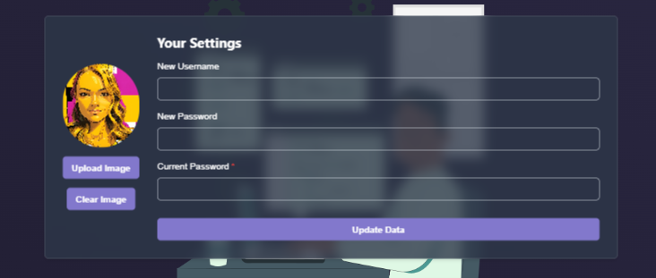
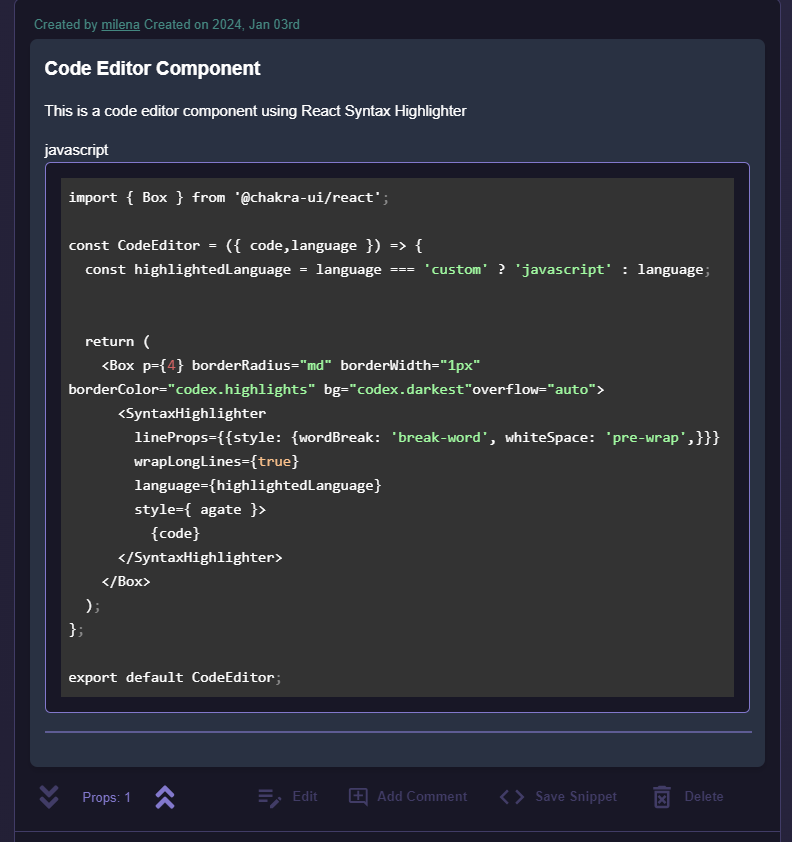
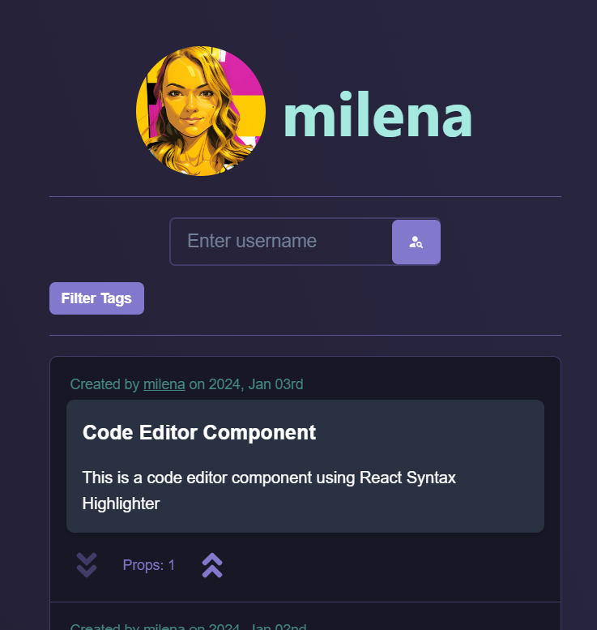

# The Codex

## Description
The Codex is an online community that allows developers and tech enthusiasts to share their knowledge and passion with others. Users can browse code snippets, post snippets, comment on snippets, save snippets, and edit and delete their own snippets. They can also "Prop" or "Drop" snippets to show their appreciation (prop) or disapproval (drop) of the code. Anyone can browse snippets, but only registered users can post, comment, prop or drop, and save snippets.
The Codex is a full-stack MERN (MongoDB, Express, React, Node) application that incorporates technologies such as [GraphQL](https://graphql.org/), [Apollo Server](https://www.apollographql.com/docs/apollo-server/), [Apollo Client](https://www.apollographql.com/docs/react/), [Cors](https://www.npmjs.com/package/cors), [React Router DOM](https://reactrouter.com/web/guides/quick-start), [React Icons](https://react-icons.github.io/react-icons/),[React Syntax Highlighter](https://github.com/react-syntax-highlighter/react-syntax-highlighter), [Chakra UI](https://chakra-ui.com/), [Framer Motion](https://www.framer.com/motion/), and [Multer](https://www.npmjs.com/package/multer).  
The Codex uses JSON Web Token (JWT) authentication for secure user login and registration. JWT tokens are decoded using JWT decode for user verification.  Cors is used to allow cross-origin requests from the client-side application to the server-side application. 
The Codex uses React Syntax Highlighter to display code snippets in a styled readable format. Chakra UI is used for styling and layout, Framer Motion for animations and Multer for profile image upload. React Icons are used for icons throughout the application.

## Table of Contents

- [Installation](#Installation)
- [Usage](#Usage)
- [Credits](#Credits)
- [License](#License)
- [Badges](#Badges)
- [Contributing](#Contributing)
- [Contact](#Contact)

## Installation
N/A, there is no installation required for this application, at this time. Future updates will include a downloadable version of the application.

## Usage
**Getting Started:**
The Codex can be accessed at (`{insert link here}`).  
  

The user can browse snippets without logging in, but must be logged in to post, comment, prop or drop, and save snippets.
The user can register by clicking the "Sign Up" button in the navigation bar and filling out the registration form. Then, the user can log in by clicking the "Login" button in the navigation bar and filling out the login form. After logged in, the user will be redirected to the main page where they can browse snippets. They can filter snippets by tags if desired. 

**Navigation:**
The user can access a user menu by clicking the icon in the top right corner of the navigation bar. The user menu allows the user to access their profile, settings, saved snippets, create a snippet, or log out.  
In their personal settings they can add a profile picture and change their username and/or password.
  

The user can create a snippet by clicking "Create" in the personal menu. The user can add a title, description, resources, tags, and code snippet along with selecting the snippet language (html, css, javascript...). The code will be highlighted according to the language selected. Once "Save" is clicked they will be re-routed to the individual snippet page to view their creation, and the new snippet will be added to the main page.  
  

From there, the user can edit or delete their snippet, add a comment, or prop or drop the snippet. The main snippet page displays all the snippets in the database in order of most recent. The user can prop or drop snippets or click on a snippet to view the individual snippet's page where they will see the code block, resources, tags, and comments. They can add a comment or save the snippet. The user can filter the snippets in the main page by tags if desired.  
On the Profile page the user can view their own snippets, or search for other users by username to view their snippets. They can also filter the snippet results by tags.
  

The saved snippets page displays all the snippets the user has saved. The user can click on a snippet to view the individual snippet's page. To remove a snippet from their saved snippets, the user can click the "unsave/save" toggle button on the individual snippet's page.

## Credits

Mongoose models framework (./server/models);
* https://github.com/average-kirigiri-enjoyer/social-network-API/tree/main/models

clearDB file setup (./server/seeds/clearDB.js);
* https://git.bootcampcontent.com/University-of-Toronto/UTOR-VIRT-FSF-PT-07-2023-U-LOLC/-/blob/main/21-MERN/01-Activities/22-Stu_Sign-JWT/Unsolved/seeders/cleanDB.js?ref_type=heads

userSeeds.json file (./server/seeds/userSeeds.json);
* https://git.bootcampcontent.com/University-of-Toronto/UTOR-VIRT-FSF-PT-07-2023-U-LOLC/-/blob/main/21-MERN/01-Activities/22-Stu_Sign-JWT/Unsolved/seeders/userSeeds.json?ref_type=heads

dateFormat file setup (./server/utils/dateFormat.js);
* https://git.bootcampcontent.com/University-of-Toronto/UTOR-VIRT-FSF-PT-07-2023-U-LOLC/-/blob/main/21-MERN/01-Activities/22-Stu_Sign-JWT/Unsolved/utils/dateFormat.js?ref_type=heads

JWT Authentication file (./server/utils/auth.js);
* https://git.bootcampcontent.com/University-of-Toronto/UTOR-VIRT-FSF-PT-07-2023-U-LOLC/-/blob/main/22-State/01-Activities/26-Stu_Actions-Reducers/Unsolved/server/utils/auth.js?ref_type=heads

Apollo Provider / Client setup (./client/src/App.jsx);
* https://git.bootcampcontent.com/University-of-Toronto/UTOR-VIRT-FSF-PT-07-2023-U-LOLC/-/blob/main/21-MERN/01-Activities/26-Stu_Resolver-Context/Unsolved/client/src/App.jsx?ref_type=heads

Multer setup (./server/server.js);
* https://github.com/UofTTeam2/TravIS/blob/main/controllers/api/trips-controller.js

Profile picture preview setup (./client/src/components/UserSettingsForm/UserSettingsForm.jsx);
* https://github.com/UofTTeam2/TravIS/blob/main/public/js/editItinerary.js

React Syntax Highlighter  
* https://github.com/react-syntax-highlighter/react-syntax-highlighter/tree/b0d771441590ff06eda265488bbf011a0140fbf4
* https://www.npmjs.com/package/react-syntax-highlighter
* https://github.com/react-syntax-highlighter/react-syntax-highlighter/pull/309
* https://stackoverflow.com/questions/62492403/enabling-line-wrap-with-react-syntax-highlighter
* https://github.com/react-syntax-highlighter/react-syntax-highlighter/issues/376

React Errors
* https://react.dev/warnings/invalid-hook-call-warning

Update Cache after Mutation
* https://www.apollographql.com/docs/react/caching/cache-interaction/#updating-the-cache-after-a-mutation
* https://www.youtube.com/watch?v=lQ7t20gFR14

React
* https://legacy.reactjs.org/docs/getting-started.html
* https://react.dev/learn
* https://react.dev/learn/adding-interactivity
* https://react.dev/learn/managing-state

Chakra UI
* https://chakra-ui.com/docs/getting-started

Debugging, adding Tags, Button logic, Conditional Rendering, and more
* https://stackoverflow.com/
* https://www.w3schools.com/
* https://developer.mozilla.org/en-US/
* https://www.google.com/
* https://chat.openai.com/

## License
This project is licensed under the [MIT License](https://opensource.org/licenses/MIT).

## Badges
**License:**
- 
**Frontend:**
- 
- 
- 
- 
- 
- 
- 
- 
- 
- 
- 

**Backend:**
- 
- 
- 
- 
- 
- 
- 
- 
- 
- 
- 
- 

## Contributing
Create an issue in GitHub [repo](https://github.com/theApostols/the-codex/issues)

## Contact Us
- [GitHub](https://github.com/theApostols)
- [Email](mailto:theapostolsofveronica@outlook.com)
***
Created by The Apostols ©2024
